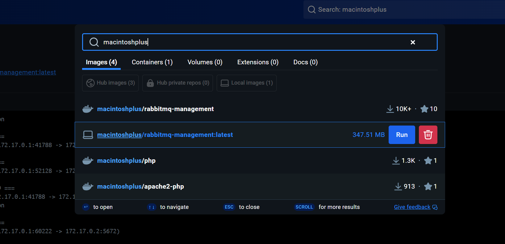
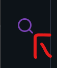
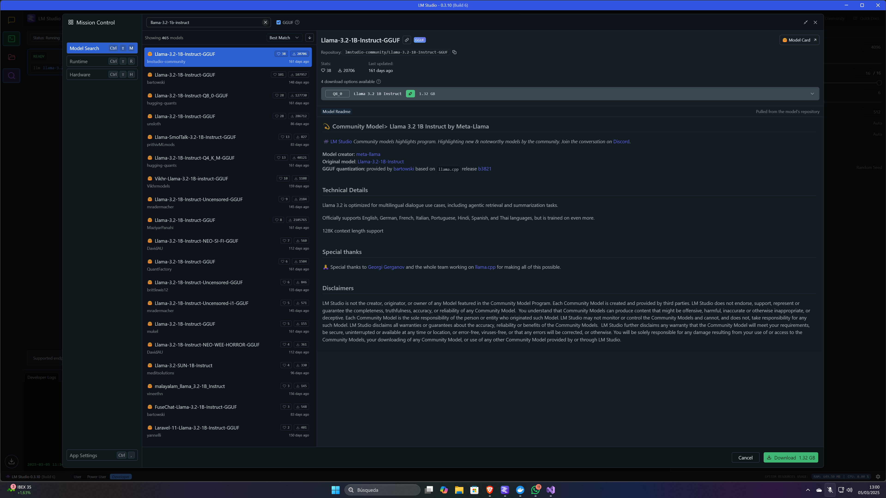
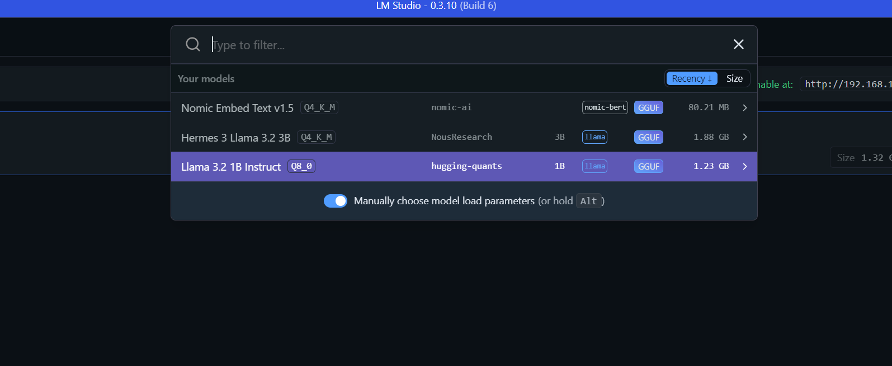
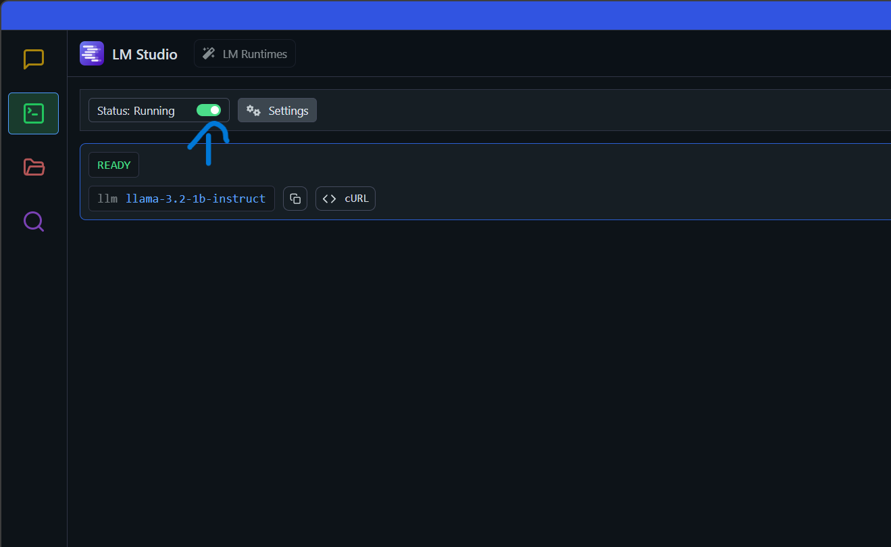
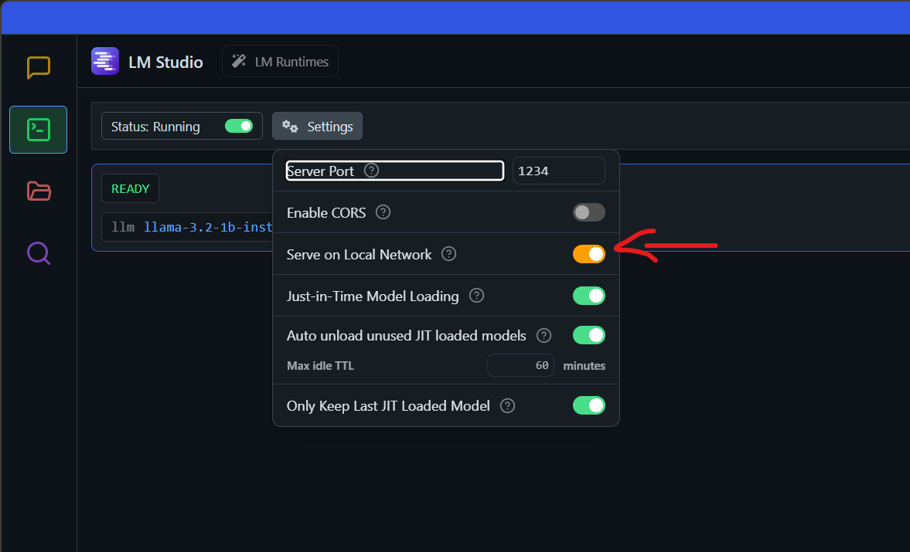

# MAUI Rabbit IA
This program is designed to use AI loaded in LMStudio to interact with other AIs through a fanout RabbitMQ exchange. 
Therefore, you will need to install RabbitMQ using Docker Desktop.

## Instalation
How I say before, you will need specific softwares to run this program:

-  Program
   ```commandline
       git clone https://github.com/Maxbleu/MAUI_Rabbit_IA.git
   ```

-  [Docker Desktop](https://docs.docker.com/get-started/get-docker/)
   - RabbitMQ Container: macintoshplus/rabbitmq-management:latest
   

   When you finish to download the container in the configuration,
   you will expose the port 5672

-  [LMStudio](https://lmstudio.ai/)
  
   First of all, if you want to load a small IA model, you will need to go the last option of
   the left vertical menu named ```Discover```

   

   Search in the bar for example ```llama-3.2-1b-instruct```, when you select
   the model clicked in download button.

   

   When you download the model, to load the model downloaded you will click
   in the option above <br>```Select a model to load``` and click in ```Load model```

   

   You need to put your LMStudio in server mode and you can do it,
   clicking in the second option of the left vertical menu named ```Developer```

   

   Finally, you need to activate in ```settings``` the first option ```serve on local network```

   